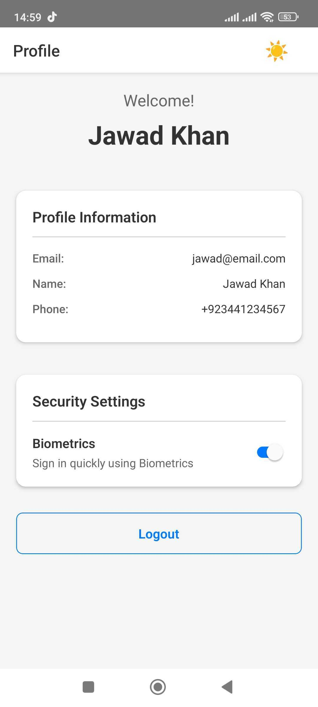

# Video Hosting Options for Large Files

Your video is **60MB** - too large for GitHub (recommended max: 10MB). Here are your options:

## ✅ **Option 1: Upload to YouTube (RECOMMENDED)**

**Best for**: Public repos, professional presentation

### Steps:
1. Go to [YouTube Studio](https://studio.youtube.com)
2. Click "Create" → "Upload videos"
3. Upload your 60MB video
4. Set visibility:
   - **Unlisted**: Only people with link can view (recommended)
   - **Public**: Anyone can find it
5. Copy the video URL
6. Update README.md: Replace `YOUR_VIDEO_LINK_HERE` with YouTube URL

**Example:**
```markdown
> 📹 **[Watch Full Demo Video](https://www.youtube.com/watch?v=xxxxx)**
```

**Pros**: 
- ✅ Free, unlimited storage
- ✅ Professional embed options
- ✅ Fast streaming
- ✅ Works on all devices

---

## ✅ **Option 2: Loom (Quick & Easy)**

**Best for**: Quick screen recordings

### Steps:
1. Go to [Loom.com](https://www.loom.com) (free account)
2. Upload your video or record directly
3. Copy share link
4. Update README.md

**Pros**:
- ✅ Super easy
- ✅ Clean player interface
- ✅ No YouTube branding

---

## ✅ **Option 3: Google Drive**

**Best for**: Private sharing

### Steps:
1. Upload to [Google Drive](https://drive.google.com)
2. Right-click → "Get link" → "Anyone with the link"
3. Copy link
4. Update README.md

**Pros**:
- ✅ Simple
- ✅ Already have Google account
- ✅ Control access

---

## ✅ **Option 4: Compress Video (Keep on GitHub)**

**Best for**: Keeping everything in one repo

### Steps:
```bash
# Install FFmpeg (if not already installed)
brew install ffmpeg

# Compress video to ~5-8MB
ffmpeg -i input.mp4 \
  -vcodec h264 \
  -crf 28 \
  -preset fast \
  -vf scale=720:-2 \
  docs/videos/demo.mp4

# Result: Much smaller file, good quality
```

**Pros**:
- ✅ Video stays in repo
- ✅ No external dependencies

**Cons**:
- ❌ Lower quality
- ❌ Still increases repo size

---

## ✅ **Option 5: Vimeo**

**Best for**: Professional presentation, no ads

### Steps:
1. Go to [Vimeo.com](https://vimeo.com)
2. Upload video (free tier: 500MB/week)
3. Copy link
4. Update README.md

**Pros**:
- ✅ Clean, professional player
- ✅ No ads
- ✅ Good for portfolios

---

## 🎯 **My Recommendation:**

### For Job Applications / Client Work:
**Use YouTube (Unlisted)**
- Most reliable
- Professional
- Always works
- Clients expect it

### Quick Example Update:

```markdown
### Demo Video

<p align="center">
  <a href="https://www.youtube.com/watch?v=YOUR_ID">
    
  </a>
</p>

> 📹 **[Watch Full Demo Video](https://www.youtube.com/watch?v=YOUR_ID)** - Complete walkthrough (2 min)
```

---

## 📝 Video Best Practices:

### Content (30-90 seconds):
1. **0-10s**: App launch, show splash/login
2. **10-25s**: Registration flow with validation
3. **25-40s**: Login with biometrics
4. **40-55s**: Profile screen, dark mode toggle
5. **55-65s**: Account lockout demo
6. **65-75s**: Password reset
7. **75-90s**: Logout and end

### Recording Tips:
- Use simulator/emulator (cleaner than real device)
- Show keyboard interactions
- Demonstrate validation errors
- Toggle dark mode
- Show biometric prompt
- Keep it smooth (no fumbling)

---

**After uploading, delete the local 60MB file:**
```bash
# Don't commit large file to Git
rm docs/videos/demo.mp4  # If you created it
```

